# QC Pulse

**Laboratory quality-control monitoring for a hospital immunoassay lab.**

Clinical labs must prove every diagnostic result is trustworthy. Before patient samples are reported, control samples are run and their optical-density readings plotted on a Levey–Jennings chart, then tested against the Westgard multi-rule set — an international standard for deciding whether a run is in control or must be rejected and repeated.

QC Pulse replaces the paper-and-Excel version of that workflow: it charts control runs, evaluates all seven Westgard rules automatically, tracks reagent lot lifecycles, attributes every run to the analyst who performed it, and produces the letterheaded reports the lab files for accreditation.

Built for the **Vaccine Preventable Disease Referral Laboratory (VPDRL)** at **Zamboanga City Medical Center**.

**🔗 Live demo — [qc-pulse.vercel.app](https://qc-pulse.vercel.app)**

> Sign in with `demoaccount@gmail.com` / `Analyst@2025`, or use the **Quick login** panel to switch between Analyst, Supervisor and Admin. The demo seeds itself with a full year of control data on first load — nothing to set up.

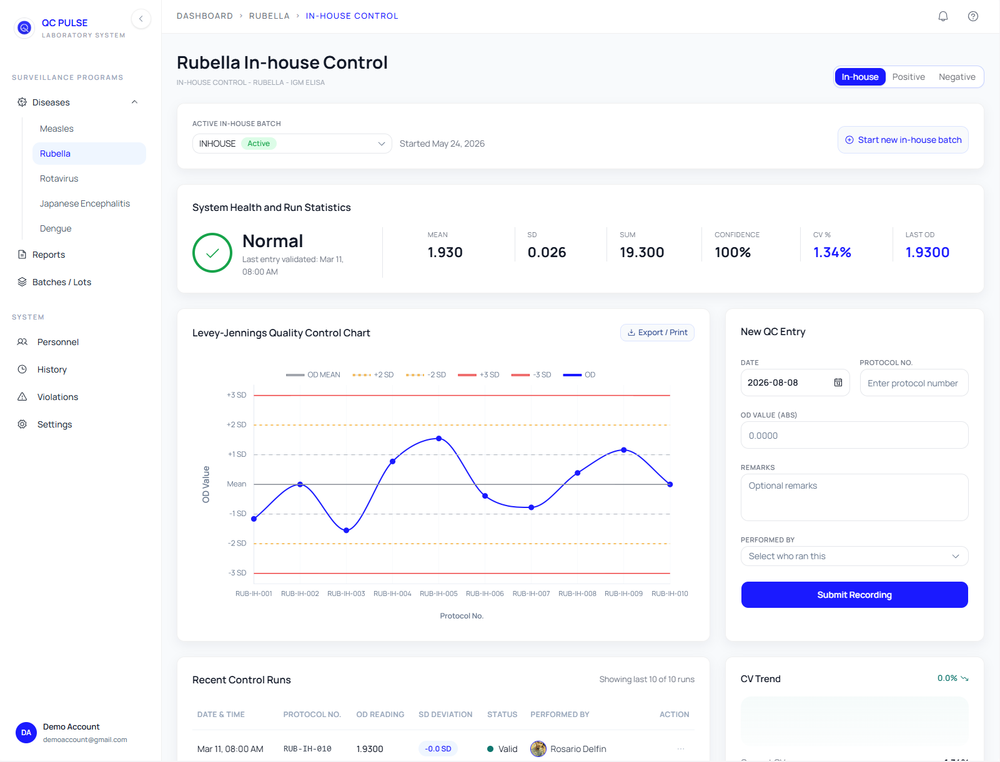

<sub>Rubella in-house control — Levey–Jennings chart with ±1/2/3 SD bands, live run statistics, rolling CV trend, and attributed run history.</sub>

---

## What it does

| | |
|---|---|
| **Levey–Jennings monitoring** | Control runs charted against ±1/2/3 SD bands, with points coloured by z-score and violations marked in place. |
| **Westgard multi-rule evaluation** | All seven rules — `1₂ₛ` `1₃ₛ` `2₂ₛ` `R₄ₛ` `4₁ₛ` `10ₓ` `7T` — evaluated on every run, separated into warnings and rejections. |
| **Rolling CV trend** | A 10-run rolling coefficient of variation with sparkline, flagging drift before it becomes a rejection. |
| **Reagent lot lifecycle** | Lots and in-house batches tracked from receipt through expiry to archival, with mean-shift detection across lot changes. |
| **Run attribution** | Every entry is bound to a personnel record, so a result traces to the analyst who produced it and survives their leaving the roster. |
| **Reports & exports** | Per-lot or whole-disease reports as letterheaded PDF, multi-sheet Excel, or CSV. |
| **Violations & audit log** | Rule breaches raised as violations with corrective-action tracking; every edit and deletion recorded. |

Five disease programmes (measles, rubella, rotavirus, Japanese encephalitis, dengue) × three control types (in-house, positive, negative), each with independent lot histories.

### Reports & exports

Per-lot CSV, Excel and PDF, or a full per-disease report covering all three controls. Actions are colour-coded by format.

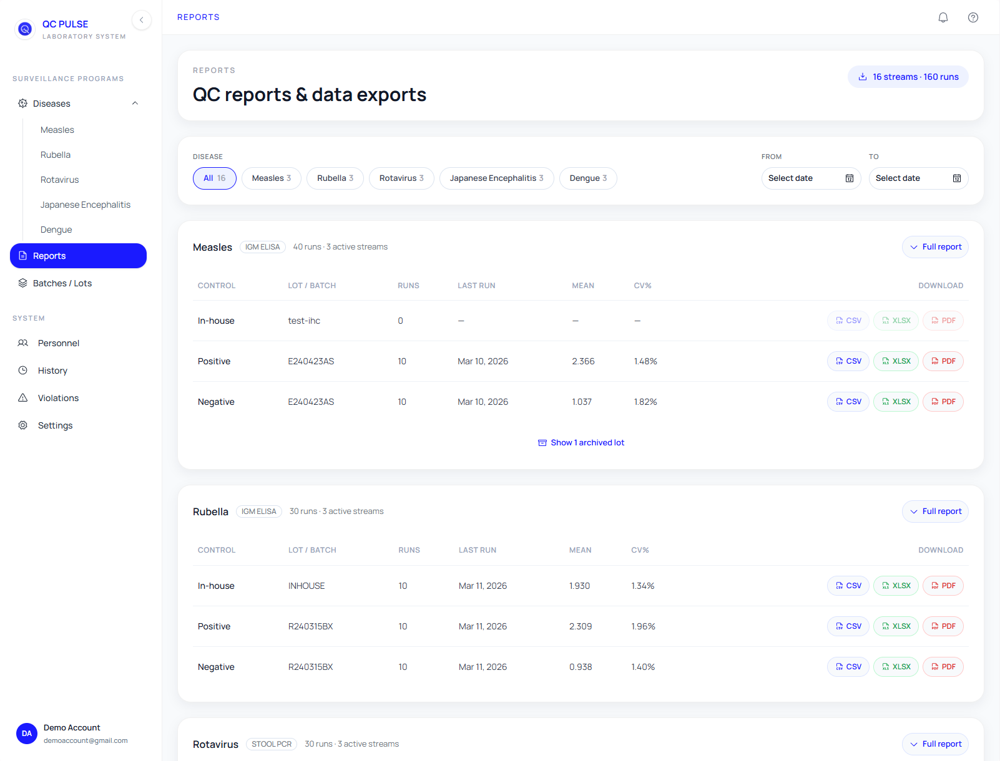

### Letterheaded report output

Reports render an offscreen A4 layout with the laboratory's letterhead, previewed at the exact page geometry the PDF is written to.

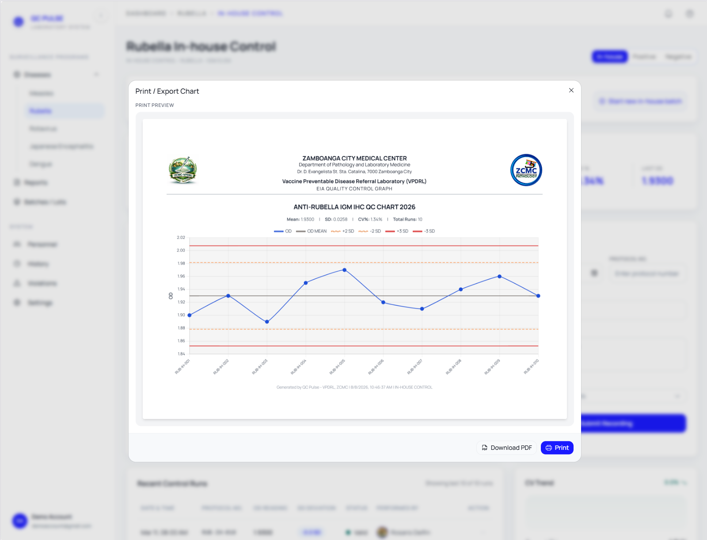

### Personnel & run attribution

Every run is bound to an analyst. Deactivating someone removes them from the entry picker while preserving the runs already attributed to them.

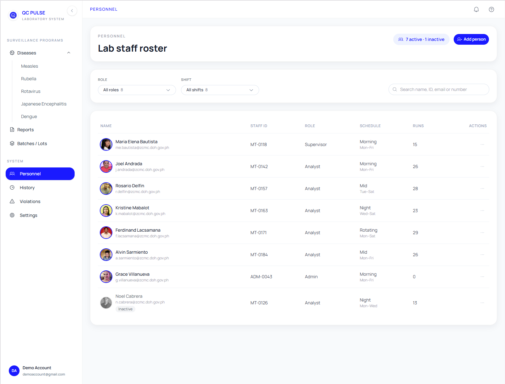

### Surveillance programmes

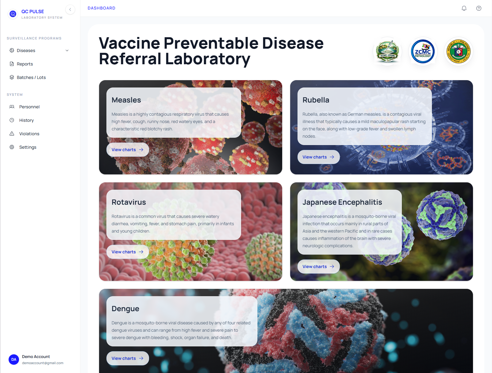

### Responsive

Every surface works on a phone. Below `lg` the sidebar collapses behind a menu trigger that carries the current page name, cards stack to a single column, and wide data tables scroll horizontally inside their own container rather than crushing their columns.

<table>
  <tr>
    <td width="33%">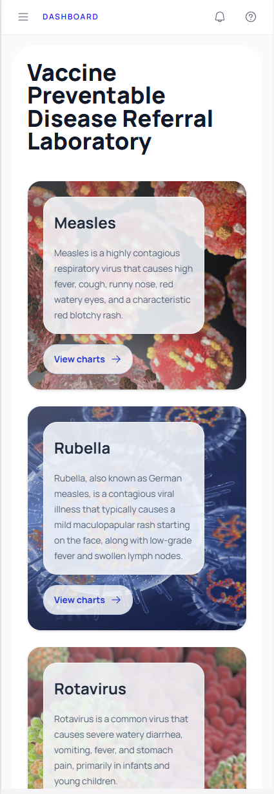</td>
    <td width="33%">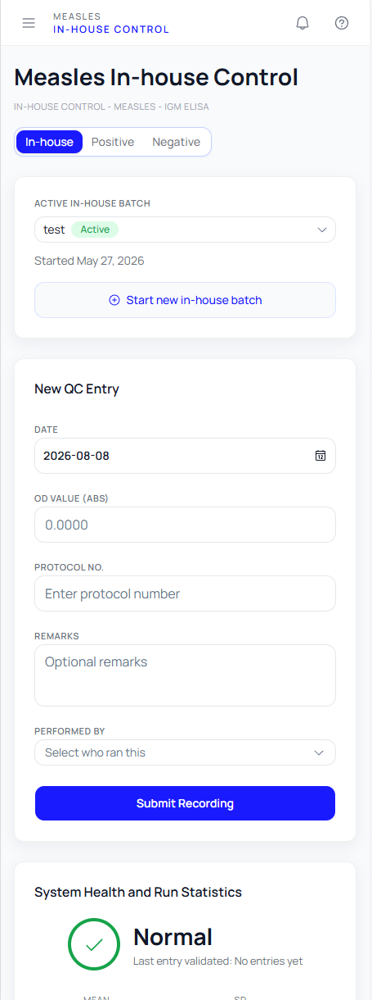</td>
    <td width="33%">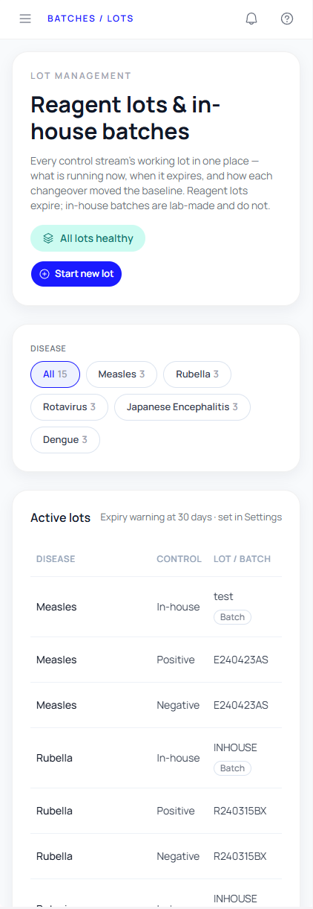</td>
  </tr>
  <tr>
    <td align="center"><sub>Surveillance programmes</sub></td>
    <td align="center"><sub>Run entry &amp; statistics</sub></td>
    <td align="center"><sub>Lots &amp; batches</sub></td>
  </tr>
  <tr>
    <td width="33%">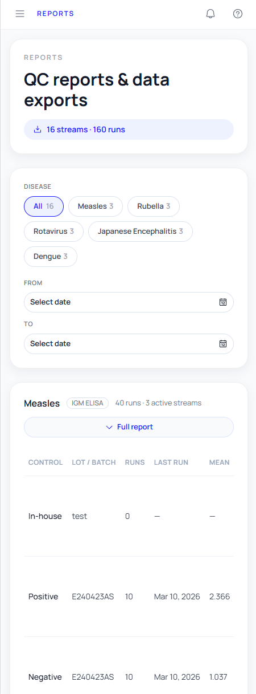</td>
    <td width="33%">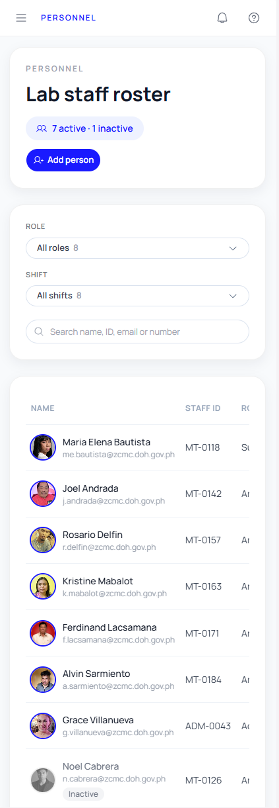</td>
    <td width="33%">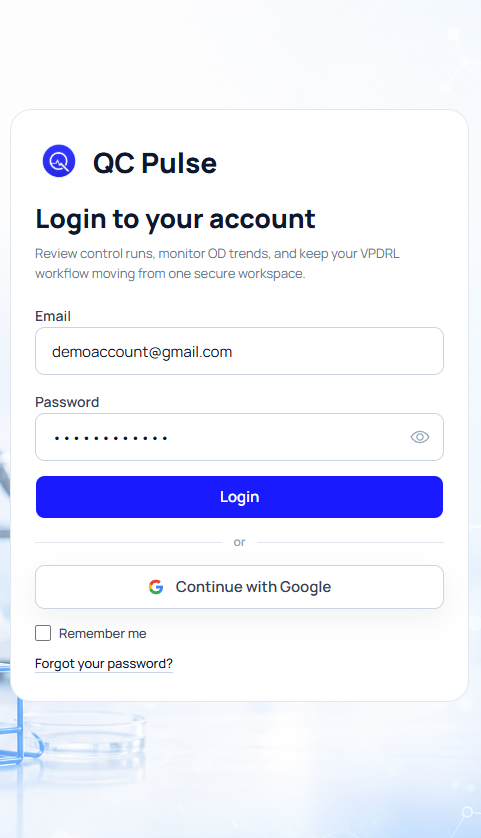</td>
  </tr>
  <tr>
    <td align="center"><sub>Reports &amp; exports</sub></td>
    <td align="center"><sub>Personnel roster</sub></td>
    <td align="center"><sub>Sign in</sub></td>
  </tr>
</table>

## Stack

| Layer | Choice |
|---|---|
| Framework | React 19, TypeScript (strict), Vite 7 |
| Routing | React Router 6 |
| Styling | Tailwind CSS 4, Radix primitives, shadcn-style component layer |
| Charts | Chart.js 4 with custom Levey–Jennings plugins |
| Motion | Framer Motion |
| Forms | React Hook Form |
| Documents | jsPDF + html2canvas (PDF), SheetJS (XLSX) |
| Testing | Vitest |

## Engineering notes

Things in here I'd point at in a code review:

**A validated storage layer, not a `JSON.parse` free-for-all.** `src/lib/qcStorage.ts` is the single boundary to persistence. Every read runs through a runtime type guard, multi-key writes are applied atomically so a failed mutation can't leave a half-written dataset, and schema additions are backfilled on read so records written by an older build still load. Seeded data is versioned, so changing a fixture propagates to existing browsers instead of silently going stale.

**Domain logic isolated from React.** Westgard evaluation, statistics, rolling CV and z-scores live in `src/utils/qc-calculations.ts` as pure functions over plain data. That's what makes them testable, and it's where the test suite is aimed.

**One derivation, many consumers.** `buildExportCatalog()` walks every disease × control × lot partition once and derives the statistics each surface needs; the reports page, the lot registry and the personnel directory all read from it rather than re-deriving. An export always matches exactly what the monitor page shows for that lot.

**Print output designed as a document, not a screenshot.** Reports render an offscreen letterheaded A4 layout, captured per page and assembled into a multi-page PDF, with the on-screen preview drawn to the same 297×210mm geometry and margins the PDF actually writes.

**Accessibility and theming taken seriously.** Radix primitives throughout for focus management and keyboard interaction, a collapsible sidebar with hover flyouts that stay operable by keyboard, and semantic colour tokens rather than scattered hex values.

## Testing

```bash
npm test
```

37 tests covering the parts where a bug would be a *clinical* problem rather than a cosmetic one — the Westgard rule engine in particular: each rule's detection, the boundaries between them (a 2SD breach is a warning, 3SD is a rejection), and the cases that must *not* fire (two breaches on opposite sides of the mean are not a `2₂ₛ` violation; a plateau is not a `7T` trend).

## Scope & trade-offs

**The backend is in active development.** The application is deliberately frontend-first: the full QC workflow, rule engine, reporting and audit trail are complete and running against a browser-persisted store, so the domain logic could be built and validated before committing to a backend contract.

That store sits behind a single interface (`qcStorage.ts`) with runtime validation, atomic writes and a backup/restore path already in place — so it is a seam, not a shortcut. Firebase is the intended target and its configuration is already scaffolded in `.env.example`; swapping the implementation behind that interface is the remaining work, and no consumer of it changes.

Demo authentication is likewise mocked, which is what lets the live demo be explored instantly without a signup wall.

## Running locally

```bash
git clone https://github.com/dev-jasp/lab-qc-dashboard.git
cd lab-qc-dashboard
npm install
npm run dev
```

| Script | |
|---|---|
| `npm run dev` | Dev server |
| `npm run build` | Typecheck and production build |
| `npm test` | Test suite |
| `npm run lint` | ESLint |

## Roadmap

- Firebase persistence and authentication behind the existing storage interface
- Timestamped runs, enabling shift-aware attribution against personnel duty schedules
- Component and interaction tests alongside the current unit suite
- Multi-site support for additional referral laboratories

---

Built by [dev-jasp](https://github.com/dev-jasp).
